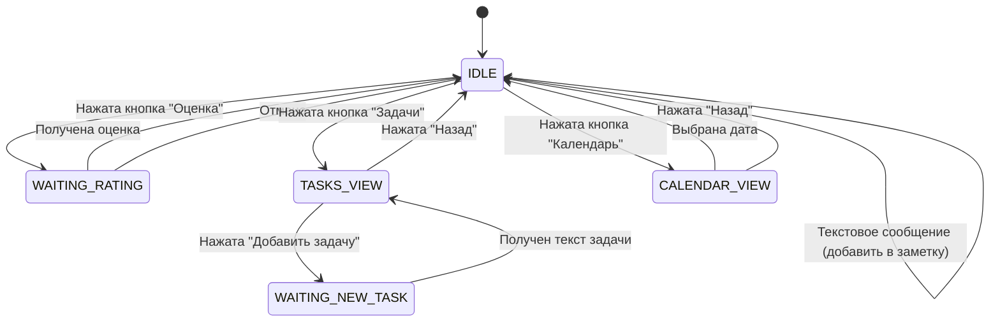

# Telegram Notes Bot - Interactive Architecture Design

## Обзор

Переработка бота для интерактивного взаимодействия через inline-кнопки вместо текстовых команд.

## Требования

### Функциональные требования

1. **Главное меню** - появляется под каждым сообщением с кнопками:
   - 📊 Поставить оценку дню
   - ✅ Задачи
   - 📝 Получить заметку
   - 📅 Календарь

2. **Система оценок**
   - Ожидание ввода числа от 0 до 10
   - Сохранение в поле `Оценка:` в frontmatter заметки

3. **Управление задачами**
   - Просмотр задач (чекбоксы из заметки)
   - Отметка выполнения/невыполнения
   - Добавление новых задач
   - Пагинация при большом количестве
   - Выход из режима задач

4. **Календарная навигация**
   - Отображение текущего месяца
   - Навигация между месяцами
   - Выбор даты
   - Создание заметки при отсутствии
   - Взаимодействие с выбранной заметкой
   - Возврат к текущей дате

5. **Работа с заметками**
   - Отображение активной даты
   - Все операции доступны для любой выбранной даты
   - Текстовые сообщения добавляются в активную заметку

## Архитектура системы состояний

### Состояния пользователя (User States)

```python
class UserState(Enum):
    IDLE = "idle"                    # Обычный режим
    WAITING_RATING = "waiting_rating"  # Ожидание оценки
    TASKS_VIEW = "tasks_view"        # Просмотр задач
    WAITING_NEW_TASK = "waiting_new_task"  # Ожидание текста новой задачи
    CALENDAR_VIEW = "calendar_view"  # Просмотр календаря
```

### Контекст пользователя (User Context)

```python
@dataclass
class UserContext:
    user_id: int
    state: UserState
    active_date: str  # Формат: DD-MMM-YYYY
    calendar_month: int  # Для навигации по календарю
    calendar_year: int
    task_page: int = 0  # Для пагинации задач
    last_message_id: int = None  # Для редактирования сообщений
```

## Структура Callback Data

### Формат callback_data

Используем формат: `action:param1:param2:...`

```python
# Главное меню
"menu:rating"           # Поставить оценку
"menu:tasks"            # Открыть задачи
"menu:note"             # Показать заметку
"menu:calendar"         # Открыть календарь

# Оценки
"rating:cancel"         # Отмена ввода оценки

# Задачи
"task:toggle:0"         # Переключить задачу #0
"task:add"              # Добавить задачу
"task:page:1"           # Страница 1
"task:back"             # Вернуться в меню

# Календарь
"cal:prev"              # Предыдущий месяц
"cal:next"              # Следующий месяц
"cal:select:09-Nov-2025"  # Выбрать дату
"cal:today"             # Вернуться к сегодня
"cal:back"              # Вернуться в меню

# Навигация
"nav:menu"              # Главное меню
```

## Структура файлов

```
src/
├── __init__.py
├── bot.py              # Инициализация бота
├── config.py           # Конфигурация
├── utils.py            # Утилиты
├── notes.py            # Работа с заметками
├── handlers/           # Обработчики (новая структура)
│   ├── __init__.py
│   ├── commands.py     # Команды (/start)
│   ├── messages.py     # Текстовые сообщения
│   ├── callbacks.py    # Callback query обработчики
│   └── menu.py         # Генерация меню
├── states/             # Управление состояниями
│   ├── __init__.py
│   ├── manager.py      # StateManager
│   └── context.py      # UserContext
├── features/           # Функциональные модули
│   ├── __init__.py
│   ├── rating.py       # Система оценок
│   ├── tasks.py        # Управление задачами
│   ├── calendar.py     # Календарная навигация
│   └── notes_ops.py    # Операции с заметками
└── keyboards/          # Клавиатуры
    ├── __init__.py
    ├── main_menu.py    # Главное меню
    ├── tasks.py        # Клавиатура задач
    └── calendar.py     # Календарь
```

## Диаграмма состояний



## Поток взаимодействия

### 1. Главное меню

```
Пользователь отправляет сообщение
    ↓
Сообщение добавляется в активную заметку
    ↓
Отображается главное меню с кнопками:
┌─────────────────────────────────┐
│ 📊 Оценка  │  ✅ Задачи         │
│ 📝 Заметка │  📅 Календарь      │
└─────────────────────────────────┘
```

### 2. Система оценок

```
Нажата кнопка "Оценка"
    ↓
Состояние: WAITING_RATING
    ↓
Сообщение: "Введите оценку дня (0-10)"
Кнопка: [Отмена]
    ↓
Пользователь вводит число
    ↓
Валидация (0-10)
    ↓
Обновление frontmatter: "Оценка: 8"
    ↓
Состояние: IDLE
    ↓
Главное меню
```

### 3. Управление задачами

```
Нажата кнопка "Задачи"
    ↓
Состояние: TASKS_VIEW
    ↓
Парсинг задач из заметки (- [ ] / - [x])
    ↓
Отображение задач с кнопками:
┌─────────────────────────────────┐
│ ☐ Доброго утра!                 │
│ ☐ Заполнить дневник             │
│ ☑ Сделанная задача              │
├─────────────────────────────────┤
│ ➕ Добавить задачу              │
│ ◀ Назад  │  Стр 1/2  │  ▶      │
└─────────────────────────────────┘
    ↓
При клике на задачу:
    - Переключение [ ] ↔ [x]
    - Обновление в файле
    - Обновление клавиатуры
    ↓
При "Добавить задачу":
    - Состояние: WAITING_NEW_TASK
    - Ожидание текста
    - Добавление в файл
    - Возврат к TASKS_VIEW
```

### 4. Календарная навигация

```
Нажата кнопка "Календарь"
    ↓
Состояние: CALENDAR_VIEW
    ↓
Отображение календаря:
┌─────────────────────────────────┐
│      ◀  Ноябрь 2025  ▶          │
├─────────────────────────────────┤
│ Пн Вт Ср Чт Пт Сб Вс            │
│              1  2  3            │
│  4  5  6  7  8 [9] 10           │
│ 11 12 13 14 15 16 17            │
│ 18 19 20 21 22 23 24            │
│ 25 26 27 28 29 30               │
├─────────────────────────────────┤
│ 📅 Сегодня  │  ◀ Назад          │
└─────────────────────────────────┘

[9] - текущая активная дата
Даты с заметками: жирный шрифт
    ↓
При выборе даты:
    - Установка active_date
    - Создание заметки если нет
    - Состояние: IDLE
    - Главное меню с указанием активной даты
```

## Работа с заметками

### Структура заметки

```markdown
---
date: "[[09-Nov-2025]]"
title: "[[09-Nov-2025]]"
tags:
  - daily
Оценка: 8
---
- [ ] Доброго утра!
- [x] Заполнить дневник
- [ ] Новая задача
---

Текстовое сообщение 1
Текстовое сообщение 2
```

### Операции с заметками

1. **Чтение frontmatter**
   - Парсинг YAML
   - Извлечение оценки

2. **Обновление оценки**
   - Изменение поля `Оценка:`
   - Сохранение frontmatter

3. **Парсинг задач**
   - Поиск строк `- [ ]` и `- [x]`
   - Извлечение между `---` разделителями

4. **Обновление задач**
   - Переключение статуса
   - Добавление новых
   - Сохранение в файл

5. **Добавление текста**
   - Добавление в конец файла
   - После последнего `---`

## Технические детали

### Хранение состояний

```python
# В памяти (для простоты, можно использовать Redis)
user_contexts: Dict[int, UserContext] = {}

def get_context(user_id: int) -> UserContext:
    if user_id not in user_contexts:
        user_contexts[user_id] = UserContext(
            user_id=user_id,
            state=UserState.IDLE,
            active_date=get_today_filename()[:-3],
            calendar_month=datetime.now().month,
            calendar_year=datetime.now().year
        )
    return user_contexts[user_id]
```

### Парсинг задач

```python
def parse_tasks(content: str) -> List[Task]:
    """Извлечь задачи из содержимого заметки"""
    # Найти секцию между первыми двумя ---
    # Парсить строки с - [ ] или - [x]
    # Вернуть список Task(text, completed, line_number)
```

### Обновление задач

```python
def update_task(filepath: Path, task_index: int, completed: bool):
    """Обновить статус задачи в файле"""
    # Прочитать файл
    # Найти задачу по индексу
    # Изменить [ ] на [x] или наоборот
    # Записать файл
```

### Генерация календаря

```python
def generate_calendar_keyboard(year: int, month: int, active_date: str) -> InlineKeyboardMarkup:
    """Создать клавиатуру календаря"""
    # Использовать calendar.monthcalendar()
    # Создать кнопки для каждого дня
    # Выделить активную дату
    # Добавить навигацию
```

## Обработка ошибок

1. **Невалидная оценка**
   - Сообщение: "Оценка должна быть от 0 до 10"
   - Повторный запрос

2. **Ошибка чтения/записи файла**
   - Логирование
   - Сообщение пользователю
   - Возврат в IDLE

3. **Некорректный callback_data**
   - Логирование
   - Игнорирование
   - Показ главного меню

## Миграция с текущей версии

1. Сохранить старые команды `/today`, `/get` для совместимости
2. Добавить команду `/start` для показа главного меню
3. Постепенно переводить функционал на callbacks
4. Обновить документацию

## Преимущества новой архитектуры

1. ✅ Интуитивный интерфейс с кнопками
2. ✅ Визуальная навигация по календарю
3. ✅ Интерактивное управление задачами
4. ✅ Работа с любой датой, не только текущей
5. ✅ Состояния для сложных сценариев
6. ✅ Расширяемая архитектура

## Следующие шаги

1. Реализовать базовую систему состояний
2. Создать главное меню
3. Реализовать систему оценок
4. Реализовать управление задачами
5. Реализовать календарную навигацию
6. Тестирование и отладка